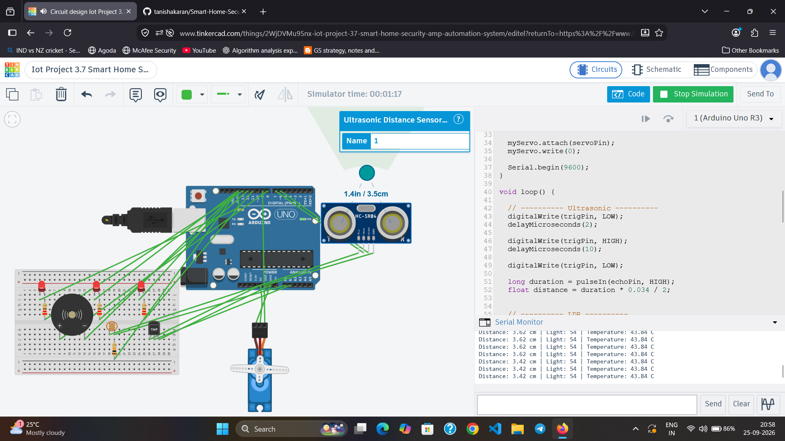

# 🏠 Smart Home Security & Automation System

An Arduino-based multi-sensor system that combines security monitoring and basic home automation using an ultrasonic sensor, LDR, temperature sensor, buzzer, LEDs, and servo motor.

## 🎯 Objective

To build a smart home system that can detect nearby objects, monitor light and temperature conditions, and automatically control security and home devices.

## 🧩 Components

- Arduino Uno
- HC-SR04 Ultrasonic Sensor
- LDR
- 10kΩ Resistor
- TMP36 Temperature Sensor
- Micro Servo Motor
- Buzzer
- 3 LEDs
- 3 × 220Ω Resistors
- Breadboard
- Jumper Wires

## 🔌 Circuit Connections

| Component | Arduino |
|---|---|
| HC-SR04 VCC | 5V |
| HC-SR04 GND | GND |
| HC-SR04 TRIG | D7 |
| HC-SR04 ECHO | D6 |
| Buzzer (+) | D8 |
| Buzzer (-) | GND |
| Servo Signal | D9 |
| Servo VCC | 5V |
| Servo GND | GND |
| LDR Output | A0 |
| TMP36 Vout | A1 |
| Light LED | D12 through 220Ω |
| Temperature LED | D13 through 220Ω |
| Security LED | D11 through 220Ω |

## ⚙️ Working

The system monitors three different conditions:

### 🔐 Security Detection
- Distance < 10 cm → Security LED ON + Buzzer ON + Servo moves to 90°
- Distance ≥ 10 cm → Security LED OFF + Buzzer OFF + Servo returns to 0°

### 🌙 Light Monitoring
- Low light → Light LED ON
- Bright light → Light LED OFF

### 🌡️ Temperature Monitoring
- Temperature > 30°C → Temperature LED ON
- Temperature ≤ 30°C → Temperature LED OFF

## 🔄 System Flow

**Sensors → Arduino → Decision Making → LEDs / Buzzer / Servo**

## 🏗️ System Architecture

```text
Sensors
   ↓
Arduino Uno
   ↓
Decision Making
   ↓
┌─────────────┬─────────────┬─────────────┐
│ Security    │ Light       │ Temperature │
│ Detection   │ Monitoring  │ Monitoring  │
└──────┬──────┴──────┬──────┴──────┬──────┘
       ↓             ↓             ↓
   Buzzer/LED      LED          LED/Alert
       ↓
   Servo Motor

 ```
This architecture shows how sensor inputs are processed by the Arduino and converted into security and automation actions.

## 🧪 Testing

The system was tested in Tinkercad by changing distance, light, and temperature conditions.

- Objects within 10 cm triggered the security alert.
- Low-light conditions activated the light LED.
- Temperature above 30°C activated the temperature LED.
- The servo responded to the security condition.

## 📸 Circuit



## 🔗 Live Tinkercad Simulation

[Open the Smart Home Security & Automation System in Tinkercad](https://www.tinkercad.com/things/2WjDVMu95nx-iot-project-37-smart-home-security-amp-automation-system)

## 💻 Technologies

- Arduino Uno
- C/C++ (Arduino)
- HC-SR04
- LDR
- TMP36
- Servo Motor
- Tinkercad Circuits

## 🧠 Concepts Learned

- Multiple sensor integration
- Analog sensor reading
- Ultrasonic distance measurement
- Servo motor control
- Conditional logic
- Digital input/output
- Sensor-based automation
- Multi-device control

## 🚀 Future Improvements

- Add PIR motion detection
- Add LCD/OLED display
- Add ESP32 Wi-Fi connectivity
- Send alerts to a mobile/web application
- Add cloud-based monitoring

---

### 👩‍💻 Author

**Tanisha Karan**  
B.Tech CSE (IoT) Student
